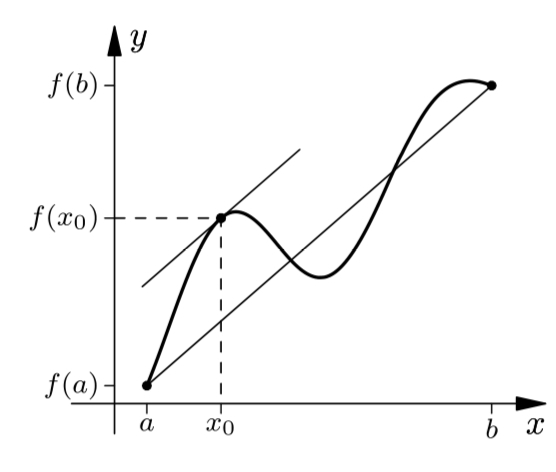

>[!THEOREM] Mean Value Theorem for Derivatives
>
>If $f: D \subseteq \mathbb{R} \to \mathbb{R}$ is [continuous](../Functions/Continuity/Continuity.md) on the closed interval $D = [a;b]$ and [differentiable](Differentiability%20of%20Real%20Functions.md) on the open interval $(a;b)$, then there exists at least one $x_0 \in (a;b)$ such that
>
>$$f'(x_0) = \frac{f(b) - f(a)}{b - a}$$
>
>>[!PROOF]-
>>
>>TODO
>
>>[!NOTE] Note: Geometric Meaning
>>
>>The theorem says that there is at least one point $(x_0; f(x_0))$ on the graph of $f$, where the tangent line to $f$ is parallel to the secant line through the points $(a; f(a))$ and $(b; f(b))$.
>>
>>
>>

