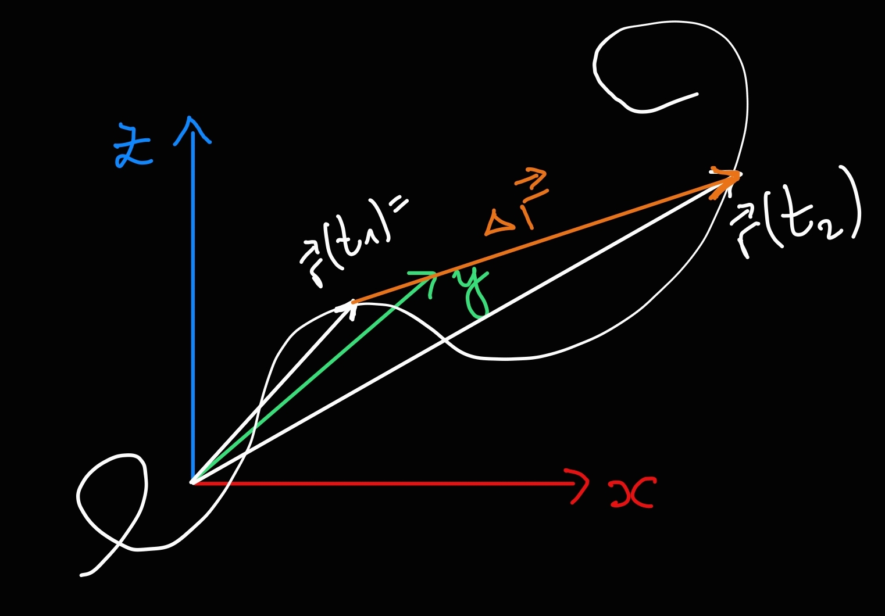

>[!DEFINITION] Definition: Displacement
>
>The **displacement** of a [point mass](../Point%20Mass.md) during the time interval $\Delta t$ between two moments $t_1$ and $t_2 \gt t_2$ is the difference in its [position](Position.md) at $t_1$ and $t_2$:
>
>$$\Delta \boldsymbol{r}\overset{\text{def}}{=} \boldsymbol{r}(t_2)-\boldsymbol{r}(t_1)$$
>
>
>